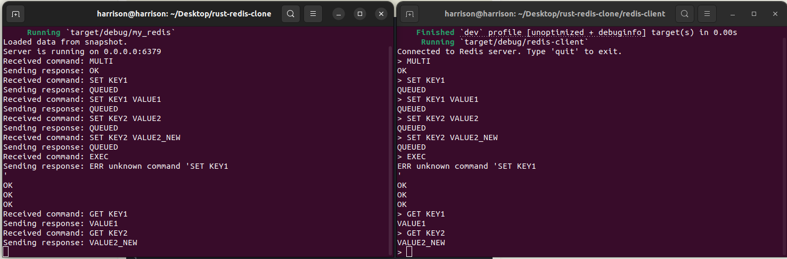

# Rust Redis Imitate


[](https://crates.io/crates/rust-redis-imitate)
[](https://docs.rs/rust-redis-imitate)

A Redis imitate implemented in Rust, featuring a modular architecture with core and advanced functionalities such as networking, command processing, data storage, caching, clustering, transactions, and pub/sub. The project also includes robust configuration, logging, monitoring systems, and tools for testing and benchmarking.

Now support commands:"SET","GET","DEL","INCR","DECR","LPUSH","RPUSH","LPOP","RPOP","LLEN","MULTI","EXEC","DISCARD". Will add new commands in the future.

If you'd like to discuss more about this project, feel free to join me on Discord for a chat!

[](https://discord.gg/8jCKt9rTtN)


## Table of Contents

- [Introduction](#introduction)
- [Core Modules](#core-modules)
- [Auxiliary Modules](#auxiliary-modules)
- [Advanced Features](#advanced-features)
- [Tools and Testing](#tools-and-testing)
- [How to Run](#how-to-run)
- [Contributing](#contributing)
- [License](#license)

## Introduction

This project is a Redis clone built in Rust, designed for learning and exploring distributed in-memory data stores. The architecture is modular, making it easy to extend and modify. It supports key Redis features like command processing, in-memory storage, and caching, along with advanced features such as clustering and transactions.

## Core Modules

### 1. Network Module (`network`)
Handles client connections, TCP server initialization, and request parsing.
- **Features**:
  - TCP server for handling client connections
  - Request parsing and processing

### 2. Command Processing Module (`commands`)
Manages parsing and execution of Redis commands.
- **Features**:
  - Command parser for interpreting client commands
  - Executor for processing supported Redis commands

### 3. Data Storage Module (`storage`)
Manages in-memory data structures and persistent storage.
- **Features**:
  - HashMap, List, Set, and other Redis-like data structures
  - Persistence through RDB and AOF mechanisms

### 4. Cache Module (`cache`)
Implements caching strategies and handles expired keys.
- **Features**:
  - AVL Tree structure
  - LRU/LFU caching algorithms

## Auxiliary Modules

### 1. Configuration Module (`config`)
Handles configuration file parsing and runtime configuration management.

### 2. Logging Module (`logging`)
Manages logging for errors and operations.

### 3. Monitoring Module (`monitoring`)（TODO）
Collects performance metrics and status reports.

## Advanced Features

### 1. Cluster Module (`cluster`)（TODO）
Supports node communication, data sharding, and failover mechanisms.

### 2. Transactions Module (`transactions`)
Implements Redis's MULTI/EXEC commands with optimistic locking (CAS).

### 3. Publish/Subscribe Module (`pubsub`)
Manages channels and message distribution for Redis's pub/sub feature.

## Tools and Testing

### 1. Benchmarking (`benchmarks`)
Includes a performance testing suite to evaluate system efficiency.

### 2. Unit and Integration Testing
Each module has corresponding unit and integration tests for end-to-end validation.

## How to Run

Open a terminal and type:

```bash
cargo run
```

Open another terminal and:

```bash
cd rust-redis-client
cargo run
```

Let's try some commands:




## Contributing

Contributions are welcome! Open an issue or pull request.

## License

This project is licensed under the MIT License.